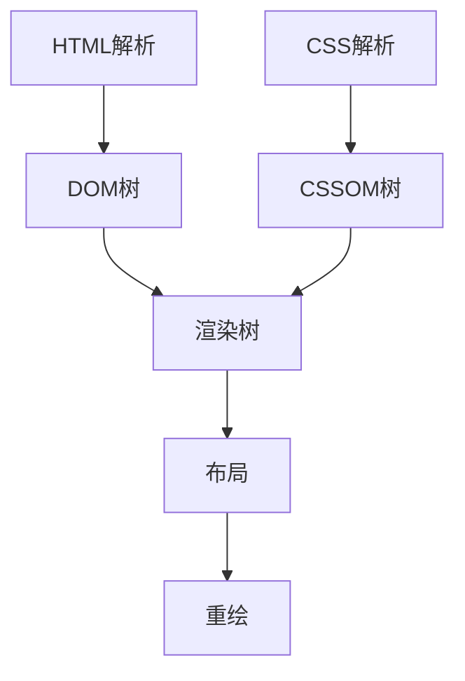

- 浏览器渲染过程  

`Js文件会阻塞浏览器的渲染，所以日常将CSS置前，JS置后`  

- 浏览器同源策略  
> 浏览器对于cookie、localstorage等访问有同源限制  
> 同源：协议、域名、端口都相同  
>方法：domain、jsonp、iframe（详情还需要再深入学习）  

- React useRef  
`useRef`:该api应用于子组件向父组件传值，搭配`useImperativeHandle`使用。将ref从父组件转发至子组件的DOM中，搭配`forwardRef`使用。  
`useImperativeHandle`:useImperativeHandle可以让你在使用 ref 时自定义暴露给父组件的实例值。  
（实例待补充）
`forwardRef`：将ref从父组件中转发到子组件中的dom元素上，子组件接受props和ref作为参数（此应用暂未遇到）
